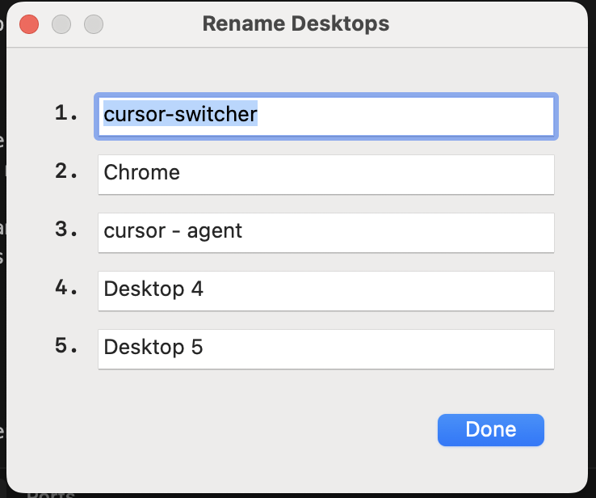

# Switcher

A lightweight macOS menu bar app for naming and switching between desktop Spaces.




## Features

- Shows current desktop name in the menu bar
- Lists all desktops in a dropdown menu
- Click to switch between desktops (1–9)
- Rename any desktop with custom names
- Names persist across app restarts

## Requirements

- macOS 13.0+ (Ventura or later)
- Swift 5.9+
- "Switch to Desktop X" shortcuts enabled in System Settings

## Setup

### 1. Enable Desktop Switching Shortcuts

Go to **System Settings → Keyboard → Keyboard Shortcuts → Mission Control** and enable
"Switch to Desktop 1" through "Switch to Desktop 9" (or however many you use).

### 2. Build

```bash
chmod +x scripts/bundle.sh
./scripts/bundle.sh
```

### 3. Run

```bash
open Switcher.app
```

On first launch, macOS will ask for **Accessibility** permission. Grant it so Switcher can
simulate keyboard shortcuts to switch desktops.

### 4. Install (optional)

```bash
cp -r Switcher.app /Applications/
```

## Usage

- **Menu bar** shows `◆ <current desktop name>`
- **Click** the menu bar item to see all desktops (or use shortcut key)
- **Click a desktop** to switch to it (or num + enter)
- **Rename Desktop → pick a desktop** to give it a custom name

## Configuration

Desktop names are stored in `~/.config/switcher/spaces.json`.
